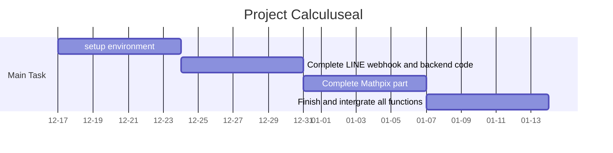

# Python Final Project --- Calculuseal

# 動機
每週相同時間必會發生的情景。週四凌晨，早上10點的微積分作業死線就快到了，這時寫作業(尤其是積分)的時候算到卡住，想破頭也想不到怎麼積，卻看著隔壁的室友神來一筆代換就算出答案，然後就去睡了。這時心裡必然相當苦惱，有點想找個人聊聊，如果這個人能幫我完成微積分作業那就更完美了。於是LINE的聊天機器人 --- Calculuseal(微積海豹)現身來解決問題了。

# 功能
用LINE傳訊息給Calculuseal
1. 傳圖片：用Mathpix解析圖片中數學式後，回傳計算結果(圖片)
    - 如果失敗，叫用戶再傳一次
2. 輸入簡單數學式子：微積海豹會用文字回傳答案，可能新增額外功能：
    - 畫函數圖形
    - 天氣
    - 單位換算
    - 匯率換算
3. 問候：內建罐頭回應
4. 其它：回傳功能說明

# 實作方式
分為三部分：
1. LINE Bot API
2. Mathpix API
3. Wolfram Alpha (web service)

## LINE Bot API
1. 申請LINE開發者帳號：https://developers.line.biz/en/
1. 用虛擬主機建立webhook，將Python code丟上去當LINE BOT的後臺
    - free virtual host
        - Azure: https://azure.microsoft.com/zh-tw/free/
        - Amazon: https://aws.amazon.com/tw/cloud9/?origin=c9io
        - Heroku: https://www.heroku.com/
        - DigitalOcean: https://www.digitalocean.com/
    - 選擇最方便使用的heroku
        - 用git push程式碼就可以運作
        - 支援HTTPS
        - 
    - ngrok: generate temperate public URL
1. 罐頭回應：在 https://admin-official.line.me 做設定

1. API (Python)
    - https://developers.line.biz/en/docs/messaging-api/
    - https://github.com/line/line-bot-sdk-python

## Mathpix API
MathPix提供API，可以讀取上傳的圖片並解析其中的數學式成JSON格式，支援轉換成wolfram格式。
- https://cn.docs.mathpix.com
- https://docs.mathpix.com
- https://github.com/Moe-Net/Mathpix
- https://www.topbestalternatives.com/mathpix/


## Wolfram Alpha
輸入符合wolfram格式的數學式，計算並回傳結果(圖片)
- https://www.wolframalpha.com/
- 用BeautifulSoup把結果抓下來

# 時程

12/24：架好環境
12/31：完成LINE的webhook和後臺程式碼
1/7：完成Mathpix部分
1/17前：完成並整合所有功能

# 參考資料
Tutorial: https://ithelp.ithome.com.tw/users/20107309/ironman/1253
Notice: https://engineering.linecorp.com/zh-hant/blog/line-device-10/
ChatBot: https://www.appcoda.com.tw/line-chatbot-sdk/
linebot: https://www.oxxostudio.tw/articles/201701/line-bot.html

# UPDATE ONE
## finish backend
- LINE is now able to correctly forward message to and from this server
- hosted by Heroku
- using Django framework to server request

## finish API integration
- Mathpix(TM) for OCR, finding mathematical equations in a picture
- WolframAlpha(TM), for calculating given mathematical equations and producing result
- both are called directly with web request (API), and results are in JSON format, which is friendly for Python to parse

## not yet finished
- nowhere to put BeautifulSoup in use
- some bugs
    - only replying the first result of the equations
    - Heroku goes sleeping after a while without requests
    - images are stored on server as database entry, which could be a loss on performance with heavy loading
        - for improvement, use Cloud Service (AWS S3 for example) and store image as statics files
- more types of replies
    - stickers
    - audio
    - video
    - answers to simple questions
        - joke
        - weather
        - mood
        - simple calculation (as text message)
- notify developer (me) whenever new member follows

## timeline


# UPDATE TWO
## fix bugs
- only replying first image of results, or replying the same image repeatedly
    - timestamp not precise enough
    - add 3 more digit (milliseconds) to conquer
- break 5 reply messages limit
    - push messages instead of reply message
- remove LINE secure token for safety

## new functions
- notify developer (my LINE account) whenever new member follows
- record new friends and backup text messages into database
    - we build a backend web management interface: https://calculuseal.herokuapp.com/admin/
    - some information is concealed in case of privacy issues
    - 
    - 
    - 
- search Yahoo!(R) dictionary when user sends a English word or phrase
    - using BeautifulSoup to fetch the result
- simple calculation when user sends equations
    - e.g. 8 / 3 + 9**2
    - must be in python syntax
    - eval()

## QR code for adding friends


## Run
### Directory Structure
only showing essential files
```
+ 0710029/
  + calculuseal/ # virtualenv dir
     + requirements.txt
     + ngrok
     + Procfile
     + bin/
        + pip
        + activate
     + include/
     + lib/
        + (necessary dependencies)
     + .git/
     + calculuseal/ # django project
        + manage.py
        + calculuseal/
           + settings.py
           + urls.py
        + webhook/ # django app
           + views.py
           + admins.py
           + models.py
        + apis/
           + mathpix.py
           + wolfram.py
           + yahoodict.py
        + config/
           + line.py # LINE secure tokens
```

### Prerequisitions
we support two ways to launch the app:
1. with ngrok on local side, for easy debugging
2. upload to Heroku server, real webhook of LINE BOT

before running each of them, run the following command to enter python virtual environment (all dependencies is installed already):
on Unix-based OS: `source bin/activate`
on Windows: `bin\activate.bat`

However, in case of security issues, we will not give you login information of either our LINE developer account or our Heroku account.
But that won't be significant hindrance, since method 1 is sufficient to test the functionality of our app.
If you should want to test the app with method 1, follow instructions in the presentation "linebot.pptx".

### Run with ngrok
`ngrok` provides a public domain that forwards all HTTP/HTTPS requests to a local port (such as 127.0.0.1:8000)

first run the server locally:
`calculuseal/calculuseal/manage.py runserver 127.0.0.1:8000`

then register a ngrok account, where authentication token will be given:
https://ngrok.com
`calculuseal/ngrok authtoken <authentication_token_of_your_account>`
`calculuseal/ngrok http 8000`

finally, register a LINE developer account (choose developer trial plan):
https://developers.line.biz
and set LINE channel webhook URL to: https://<some_random_token>.ngrok.io/webhook/
the URL will be shown after ngrok launches


### Upload to Heroku
`git remote set-url heroku https://git.heroku.com/calculuseal.git`
`git push heroku master`
and set LINE channel webhook URL to: https://calculuseal.herokuapp.com/webhook/

to watch logs:
`heroku logs -t`

# TODO
- if a message cannot find its sender in Friends model, add that friend into Friends model
- HTTPS redirection
- broadcast message from admin site
- fix problem that admin site doesn't serve static file

# 附錄
## Heroku with Django
django&heroku: http://djangogirlstaipei.herokuapp.com/tutorials/deploy-to-heroku/?os=windows

## django
```
django-admin startproject calculuseal
./manage.py startapp webhook

```

## python modules
```
python3 -m virtualenv calculuseal
cd calculuseal
source bin/activate
pip3 install django dj-database-url gunicorn dj-static psycopg2
pip3 freeze > requirements.txt
```

## heroku
```
heroku login --interactive
heroku create <myapp> --buildpack heroku/python
heroku buildpacks:set heroku/python # https://devcenter.heroku.com/articles/buildpacks
heroku config:set DJANGO_SETTINGS_MODULE=calculuseal.settings
# in production stage:
# heroku config:set DJANGO_SETTINGS_MODULE=calculuseal.production_settings

echo 'web: gunicorn --pythonpath calculuseal calculuseal.wsgi' > Procfile

heroku ps:scale web=1
heroku run python calculuseal/manage.py migrate
heroku run python calculuseal/manage.py createsuperuser

heroku logs -t
```

## git
### remove secret from all commits
`git filter-branch --force --index-filter 
'git rm --cached --ignore-unmatch PATH-TO-YOUR-FILE-WITH-SENSITIVE-DATA' 
--prune-empty --tag-name-filter cat -- --all`

```
heroku git:remote -a calculuseal

git remote -v
output:
> heroku  https://git.heroku.com/calculuseal.git (fetch)
> heroku  https://git.heroku.com/calculuseal.git (push)
> origin  https://github.com/soyccan/calculuseal.git (fetch)
> origin  https://github.com/soyccan/calculuseal.git (push)

git push heroku master

if such error is encountered:
> Permission denied (publickey).
> fatal: The remote end hung up unexpectedly
then:
heroku keys:add
```

## PostgreSQL (local)
```
sudo -u postgres createuser test
createdb test
psql -U test test
```

## PostgreSQL
    - https://devcenter.heroku.com/articles/heroku-postgresql
    - https://docs.postgresql.tw/server-administration
```
heroku addons:create heroku-postgresql:hobby-dev

heroku pg:info
watch heroku pg:info
> === DATABASE_URL
> Plan:                  Hobby-dev
> Status:                Available
> Connections:           0/20
> PG Version:            10.6
> Created:               2018-12-24 10:28 UTC
> Data Size:             7.6 MB
> Tables:                0
> Rows:                  0/10000 (In compliance)
> Fork/Follow:           Unsupported
> Rollback:              Unsupported
> Continuous Protection: Off
> Add-on:                postgresql-rugged-56733

heroku pg:credentials

export DATABASE_URL=postgres://$(whoami)

# pull database
heroku pg:pull HEROKU_POSTGRESQL_MAGENTA mylocaldb --app sushi
# or with username and password
PGUSER=postgres PGPASSWORD=password heroku pg:pull HEROKU_POSTGRESQL_MAGENTA mylocaldb --app sushi

# access local database
heroku pg:psql postgresql-rugged-56733 --app calculuseal

# push database
heroku pg:push mylocaldb HEROKU_POSTGRESQL_MAGENTA --app sushi

# for troubleshooting
heroku pg:ps
heroku pg:kill
heroku pg:killall

```
